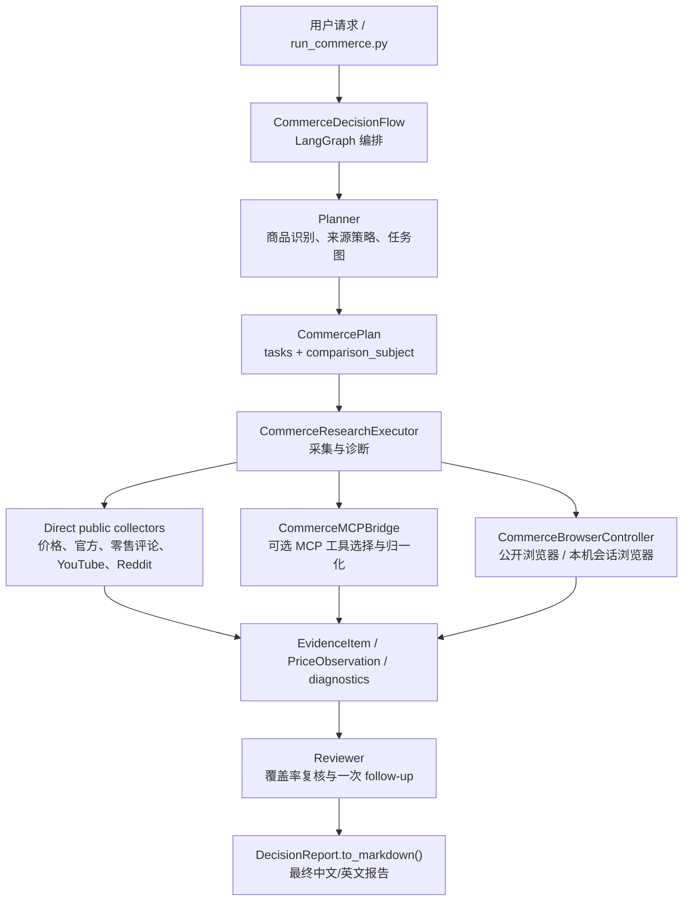
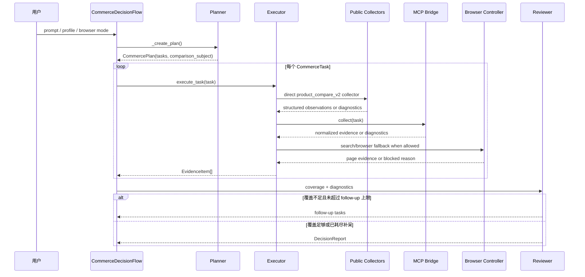

# WebScout

WebScout is a commerce-focused browser agent for product research and buying-decision reports. It plans a bounded investigation, collects public evidence from shopping sites and review channels, and produces a structured report that separates confirmed facts from partial, blocked, or low-confidence sources.

The current main workflow is `product_compare_v2`: a policy-driven product comparison flow for prices, official baselines, retail customer review signals, YouTube feedback, Reddit discussion, and SKU caveats.

## What It Does

- Identifies product brand, family, category, model, and variant hints from a free-form prompt.
- Builds a source-aware research plan with separate tasks for prices, official specs, retail reviews, video reviews, and community feedback.
- Collects evidence through direct public collectors, optional MCP tools, and search/browser fallback.
- Handles configuration-sensitive products by narrowing broad prompts to representative comparable models when needed.
- Preserves blocked sources, login walls, rate limits, and low-confidence observations as report diagnostics.
- Emits Markdown decision reports with price confidence, sample counts, source caveats, and buying recommendations.

## Architecture



## Runtime Sequence



Key implementation files:

- `run_commerce.py`: CLI entry point for commerce research.
- `app/flow/commerce.py`: LangGraph orchestration.
- `app/commerce/models.py`: shared plan, task, evidence, and report contracts.
- `app/commerce/policy.py`: product identity and source-policy rules.
- `app/commerce/executor.py`: collection pipeline and diagnostics.
- `app/mcp/commerce_public_server.py`: built-in public collectors.
- `app/commerce/browser.py`: public/session browser runtime selection.

For the full architecture notes and diagrams, see:

- `docs/commerce-agent.md`
- `docs/commerce-agent.zh.md`

## Quick Start

Recommended environment:

- Python 3.11 or newer.
- `uv` for dependency installation.
- Playwright browsers if you plan to use browser automation.

Install runtime dependencies:

```bash
uv venv
source .venv/bin/activate
uv pip install -r requirements.txt
playwright install
cp config/config.example.toml config/config.toml
```

On Windows PowerShell, activate with:

```powershell
.venv\Scripts\Activate.ps1
```

Edit `config/config.toml` and set your LLM credentials. The values below are placeholders:

```toml
[llm]
model = "gpt-4o"
base_url = "https://api.openai.com/v1"
api_key = "YOUR_API_KEY"

[llm.vision]
model = "gpt-4o"
base_url = "https://api.openai.com/v1"
api_key = "YOUR_API_KEY"
```

Local config files are ignored by git:

- `config/config.toml`
- `config/mcp.json`

Do not put real API keys into any `*.example.*` file.

## Run

Stable public-web demo:

```bash
python run_commerce.py \
  --demo-profile stable_public_web \
  --browser-session-mode public_only
```

Policy-driven product comparison:

```bash
python run_commerce.py \
  --execution-profile product_compare_v2 \
  --browser-session-mode public_only \
  --prompt "Compare iPhone 16 prices on Amazon, Best Buy, Walmart, Target, B&H, and Newegg; summarize public retail customer review signals plus YouTube and Reddit real-user feedback."
```

Representative-model example for broad product families:

```bash
python run_commerce.py \
  --execution-profile product_compare_v2 \
  --browser-session-mode public_only \
  --prompt "Compare current MacBook Pro prices on Amazon, Best Buy, Walmart, Target, B&H, and Newegg; summarize public retail customer review signals plus YouTube and Reddit real-user feedback; use public sources only and produce a detailed Chinese decision report with evidence, SKU caveats, price confidence, and buying recommendation."
```

## MCP

MCP is optional, but useful for stronger structured collection.

```bash
cp config/mcp.example.json config/mcp.json
```

The example config includes:

- `commerce_public`: local public collectors.
- `playwright`: optional Playwright MCP wrapper.
- `price_search`: optional local SSE price-search service.
- `brightdata`: optional structured web data MCP, requiring a local token environment variable.

Do not commit real MCP credentials.

## Core Agent Entrypoints

The commerce flow is the main maintained path, but the repository still includes the lower-level agent entrypoints:

```bash
python main.py
python run_mcp.py
python run_flow.py
```

Use `run_commerce.py` for product research and report generation.

## Browser Modes

| Mode | Behavior |
| --- | --- |
| `public_only` | Public browser/search paths only. Best for reproducible runs. |
| `auto` | Starts public, then can reuse a local Chrome/CDP session when configured. |
| `local_cdp` | Requires a local Chrome/CDP browser session. |

Session-backed runs can reuse your own logged-in browser state, but WebScout does not bypass CAPTCHA, login requirements, or anti-bot controls.

## Report Quality

The generated report is designed to be honest about evidence quality. A good report should include:

- comparable price observations with SKU/configuration caveats,
- official baseline or spec references when available,
- retail customer review signals,
- YouTube and Reddit feedback samples,
- unsupported or blocked sources,
- confidence notes and next-step recommendations.

If a public source blocks access or returns too little evidence, the report should say so instead of silently substituting another source.

## Verify

Run the commerce test suite:

```bash
python -m pytest tests/commerce
```

Compile the main commerce modules:

```bash
python -m py_compile \
  app/flow/commerce.py \
  app/commerce/executor.py \
  app/commerce/mcp_bridge.py \
  app/commerce/browser.py \
  app/commerce/models.py \
  app/mcp/commerce_public_server.py
```

Before publishing, check that local-only files are ignored:

```bash
git status --ignored --short config/config.toml config/mcp.json workspace logs .venv .pytest_cache
```

## Repository Layout

```text
app/commerce/                 Commerce-specific runtime modules
app/flow/commerce.py           Commerce LangGraph flow
app/mcp/commerce_public_server.py
                               Built-in public commerce collectors
docs/commerce-agent.md         Architecture documentation
docs/commerce-agent.zh.md      Chinese architecture documentation
config/config.example.toml     Local LLM/browser config template
config/mcp.example.json        Local MCP config template
run_commerce.py                Main commerce CLI
tests/commerce/                Commerce tests
```

## Known Limits

- Public websites can change, rate-limit, or block automation at any time.
- Amazon, Best Buy, Google Store, Reddit, and similar sources may require diagnostics instead of clean evidence in `public_only` mode.
- Broad product-family prompts may need representative-model narrowing or multi-SKU follow-up runs.
- Non-phone categories still benefit from more dedicated collectors and model-normalization rules.

## License

MIT.
