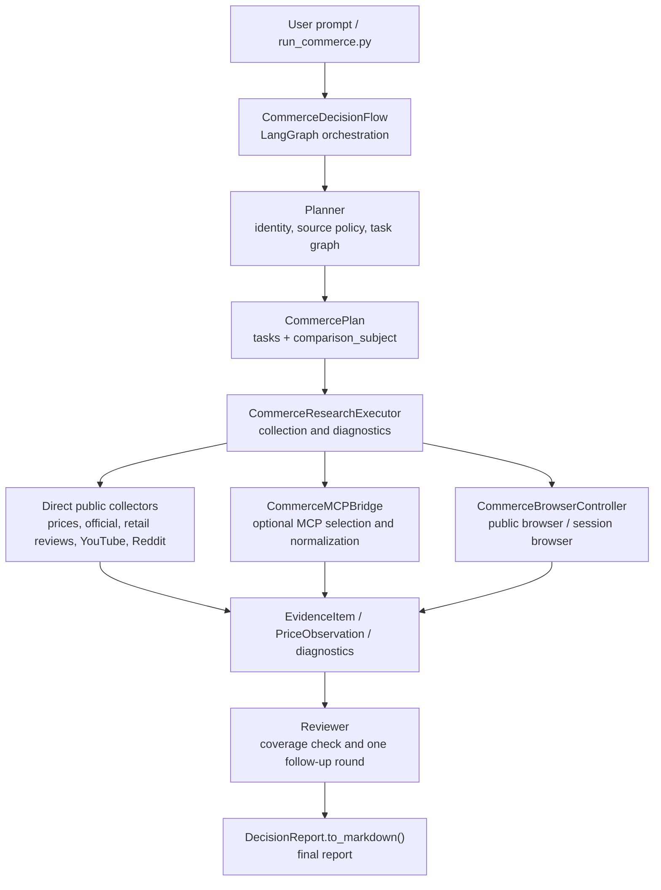
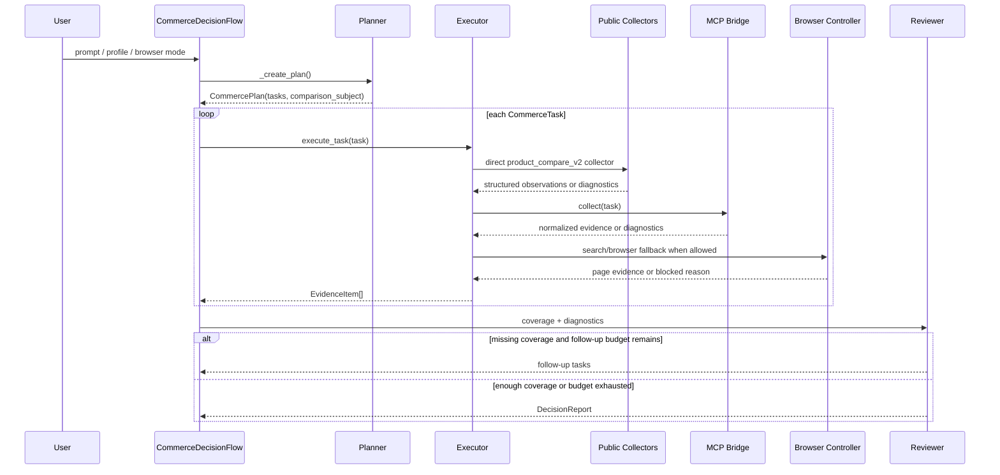
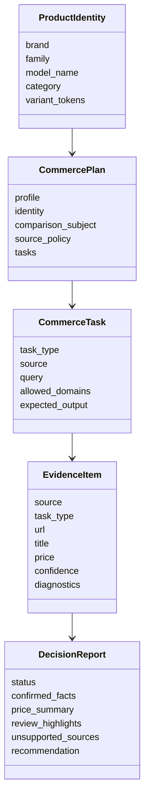
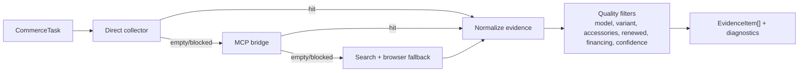

# Commerce Browser Agent Architecture

Updated: 2026-04-21

The commerce browser flow is a dedicated OpenManus path for product research, public-web collection, and purchase-decision reports. It is not just a prompt wrapper around a general browser agent. The implementation separates product identity, source policy, evidence collection, coverage review, and final report synthesis into testable modules.

The current goal is to collect prices, official baselines, retail reviews, video reviews, and community feedback from public pages, public APIs, optional MCP tools, and search/browser fallback. The report must distinguish confirmed evidence from partial evidence and blocked or missing sources.

## Profiles

| Profile | Purpose | Best for | Status |
| --- | --- | --- | --- |
| `stable_public_web` | Narrow stable public-web demo | Repeatable demos and low-risk validation | Still intentionally narrow |
| `product_compare_v2` | Policy-driven product comparison and sentiment report | Phones, laptops, tablets, audio, wearables, consoles | Main path |

`product_compare_v2` has grown from a phone-only flow into a generic product flow. It extracts brand, family, model, category, and variants, then chooses official sources, marketplaces, review sources, and filtering rules.

## Architecture



Core boundaries:

- `Planner` turns the request into a structured research plan. It does not scrape pages.
- `Executor` runs direct collectors, MCP tools, and browser fallback while recording diagnostics.
- `Reviewer` checks evidence coverage and may request one bounded follow-up round.
- `DecisionReport` owns the final delivery shape and keeps failed sources visible.

## Sequence



## Main Modules

| Module | Responsibility |
| --- | --- |
| `run_commerce.py` | CLI entry point for profile, browser mode, prompt, and report output |
| `app/flow/commerce.py` | LangGraph flow with planner, executor, reviewer, follow-ups, and report synthesis |
| `app/commerce/policy.py` | Product identity, brand/category source policies, configuration-sensitive family rules |
| `app/commerce/models.py` | Pydantic contracts for plans, tasks, evidence, prices, diagnostics, and reports |
| `app/commerce/executor.py` | Runs each task through direct collectors, MCP, and search/browser fallback |
| `app/mcp/commerce_public_server.py` | Built-in public collectors for marketplaces, official sources, retail reviews, YouTube, and Reddit |
| `app/commerce/mcp_bridge.py` | Optional MCP tool discovery, scoring, invocation, normalization, and diagnostics |
| `app/commerce/browser.py` | Runtime browser selection: `public_only`, `auto`, `local_cdp` |
| `app/commerce/grounding.py` | DOM/vision grounding helper for brittle pages, not a login or CAPTCHA bypass |
| `tests/commerce/*` | Unit and integration coverage for flow, executor, MCP bridge, browser, and models |

## Data Model



Important fields:

- `CommercePlan.comparison_subject`: representative comparable model for underspecified configuration-sensitive products.
- `EvidenceItem.diagnostics`: login wall, anti-bot block, no match, low confidence, degraded sample, and similar notes.
- `DecisionReport.status`: final state, one of `complete`, `partial`, or `incomplete`.

## `product_compare_v2` Planning

V2 planning follows this shape:

1. Extract `ProductIdentity` from the prompt.
2. Resolve brand/category source policy.
3. Detect configuration-sensitive families such as MacBook Pro, MacBook Air, laptops, and tablets.
4. If the user only names a broad family, choose a representative `comparison_subject`.
5. Create separate tasks for prices, official baseline, retail reviews, video reviews, and community feedback.
6. Attach source, query, allowed domains, and expected output to each task.

Current representative model examples:

| User input | Internal representative model | Report behavior |
| --- | --- | --- |
| `MacBook Pro` | `Apple 14-inch MacBook Pro M5` | Explicitly labeled as a representative model to avoid mixing sizes/chips |
| `MacBook Air` | `Apple 13-inch MacBook Air M4` | Explicitly labeled as a representative model |

If the prompt already names size, chip, memory, storage, or color, V2 tries to use the user's requested configuration.

## Collection Pipeline



### Direct Collectors

Direct collectors are first priority for `product_compare_v2` because they return structured fields and reduce the risk of guessing prices from page text. Current coverage includes:

- Marketplace prices from public Amazon, Best Buy, Walmart, Target, B&H, Newegg, and similar results when accessible.
- Official baselines from brand stores such as Apple, Google, Samsung, and Microsoft.
- Retail review snippets from Amazon, Best Buy, Walmart, Target, B&H, and Newegg when public pages expose them.
- YouTube public search results and metadata.
- Reddit public search/JSON paths.

### MCP Bridge

The MCP bridge plugs in stronger structured tools. It selects tools by task type, source, priority hints, and schema, then normalizes returned data into `EvidenceItem`.

MCP improves structure and coverage. It does not bypass login walls, CAPTCHAs, or anti-bot controls.

### Browser Fallback

If direct collectors and MCP do not produce enough evidence, the executor uses search plus browser fallback. The browser layer can extract public pages and use DOM/vision grounding for brittle layouts.

When a page returns login, CAPTCHA, 403, 429, bot detection, or another access block, the system records that as diagnostics instead of fabricating evidence.

## Browser Modes

| Mode | Behavior | Best for |
| --- | --- | --- |
| `public_only` | Use only public browser paths | Reproducible public-web validation |
| `auto` | Start public, then reuse local Chrome/CDP when available and useful | User-approved session-backed runs |
| `local_cdp` | Require local Chrome/CDP | Session-browser debugging |

These modes do not crack CAPTCHAs or break through login requirements. Amazon, Best Buy, Google Store, and similar sites can still be marked as blocked in `public_only`.

## Report Synthesis

`DecisionReport.to_markdown()` emits the final report. V2 reports try to include:

- Executive summary and buying recommendation.
- Representative model or user-specified configuration.
- Price table with seller, model/configuration, price, confidence, and comparability caveats.
- Official baseline for discount/premium checks.
- Retail review, YouTube, and Reddit sentiment summaries.
- Source and sample counts.
- Blocked sources, degraded samples, and next-step recommendations.

Report quality is not measured by pretending every site succeeded. It is measured by clear separation between reliable evidence, missing evidence, and non-comparable prices.

## Recommended Commands

Stable demo:

```bash
python run_commerce.py --demo-profile stable_public_web --browser-session-mode public_only
```

V2 phone example:

```bash
python run_commerce.py \
  --execution-profile product_compare_v2 \
  --browser-session-mode public_only \
  --prompt "Compare iPhone 16 prices on Amazon, Best Buy, Walmart, Target, B&H, and Newegg; summarize public retail customer review signals plus YouTube and Reddit real-user feedback."
```

V2 laptop representative-model example:

```bash
python run_commerce.py \
  --execution-profile product_compare_v2 \
  --browser-session-mode public_only \
  --prompt "Compare current MacBook Pro prices on Amazon, Best Buy, Walmart, Target, B&H, and Newegg; summarize public retail customer review signals plus YouTube and Reddit real-user feedback; use public sources only and produce a detailed Chinese decision report with evidence, SKU caveats, price confidence, and buying recommendation."
```

If a prompt is underspecified, V2 first narrows to one representative model. If the user wants multiple SKU comparisons, the prompt should list the target size, chip, memory, storage, and color.

## Known Limits

- Public pages are not stable APIs. Search results, page layouts, rate limits, and login walls can change at any time.
- Amazon review pages, Best Buy, Google Store, and similar public paths can still trigger login, CAPTCHA, or anti-bot behavior in `public_only`.
- Reddit public endpoints can return `HTTP 429`.
- Broad family names such as `MacBook Pro` or `Ninja Creami` require representative-model selection or explicit cross-SKU caveats.
- Price confidence depends heavily on model matching; memory, storage, color, renewed/used condition, financing, and bundles can make prices non-comparable.
- Further quality improvements for non-phone categories require more category-specific collectors and model normalization rules.

## Next Improvements

1. Add dedicated parsers for laptops, kitchen appliances, cameras, and game consoles.
2. Strengthen structured price and review extraction for Walmart, Target, B&H, and Newegg.
3. Split price confidence into model match, freshness, source reliability, and configuration comparability.
4. Add a multi-SKU mode for broad prompts, for example separate runs for `MacBook Pro 14-inch M5`, `14-inch M5 Pro`, and `16-inch M5 Pro`.
5. Improve report templates so Markdown output looks closer to a formal research report with cleaner tables, footnotes, and risk callouts.
