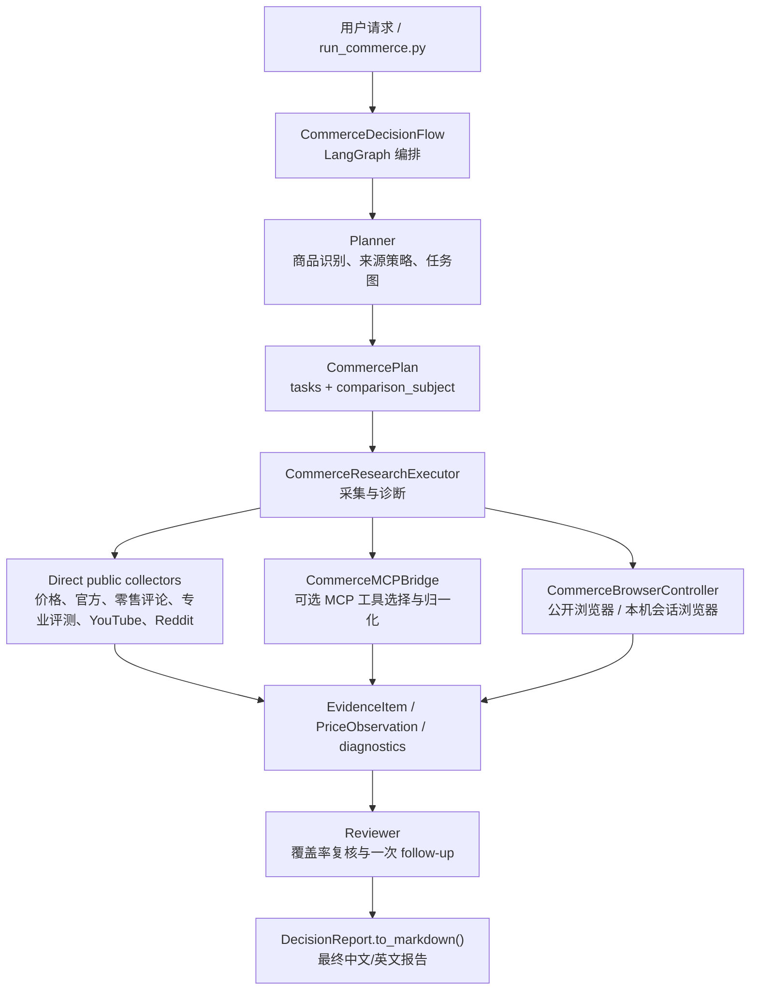
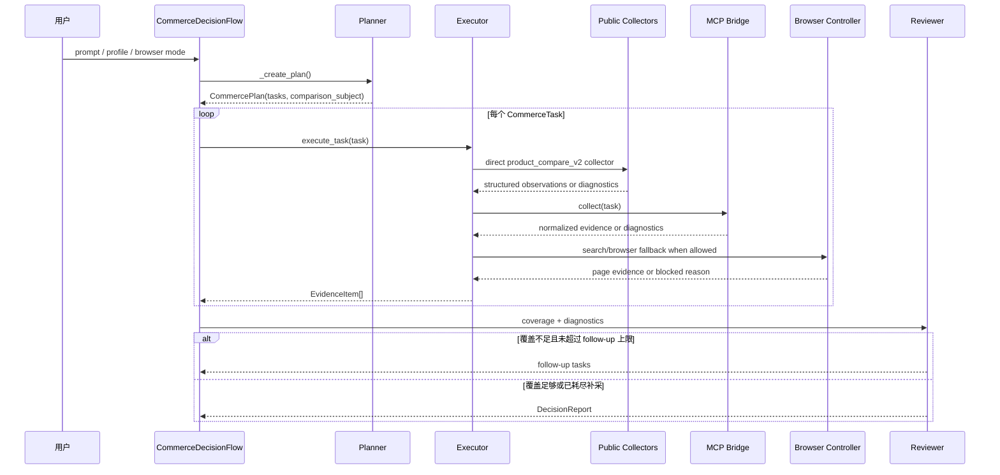
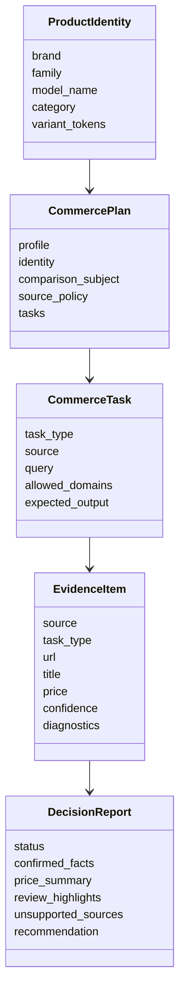
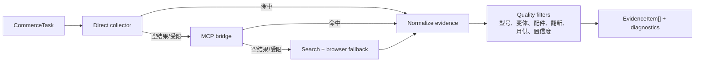

# Commerce Browser Agent 架构文档

更新于：2026-04-21

Commerce browser flow 是 OpenManus 上面向商品研究、公开网页采集和购买决策报告的一条专用链路。它不是通用网页浏览器的简单 prompt 包装，而是把商品识别、来源策略、证据采集、覆盖率复核和最终报告合成拆成可测试的模块。

当前目标是：在 `public_only` 或可选会话浏览器模式下，尽量从公开网页、公开 API、MCP 工具和搜索结果中收集价格、官方基线、零售评论、专业评测/公开网页、视频评测和社区反馈，并在报告中明确区分“已确认”“部分确认”“被拦截/缺失”的证据。

## Profile

| Profile | 用途 | 适合场景 | 当前状态 |
| --- | --- | --- | --- |
| `stable_public_web` | 稳定公开网页演示 | 重复 demo、低风险验收 | 仍以较窄商品路径为主 |
| `product_compare_v2` | 策略化商品比价与口碑报告 | 手机、笔记本、平板、音频、可穿戴、游戏主机等 | 主力路径，支持更多来源和更丰富报告 |

`product_compare_v2` 已经从手机专用流程扩展为泛商品流程。它会根据用户输入识别品牌、系列、型号和变体，再决定官方源、商城源、评论源和过滤规则。

## 总体架构



这条链路的核心边界是：

- `Planner` 只负责把请求变成结构化研究计划，不直接抓网页。
- `Executor` 负责跑 direct collector、MCP 和浏览器 fallback，并记录每一步诊断。
- `Reviewer` 根据证据覆盖率决定是否追加一轮 follow-up，最后进入报告合成。
- `DecisionReport` 是最终交付格式，报告不隐藏失败来源。

## 调用时序



## 核心模块

| 模块 | 责任 |
| --- | --- |
| `run_commerce.py` | CLI 入口，选择 profile、浏览器会话模式、prompt，并输出报告 |
| `app/flow/commerce.py` | LangGraph 编排，包含 planner、executor、reviewer 节点和最终报告合成 |
| `app/commerce/policy.py` | 商品身份识别、品牌/品类 source policy、配置敏感商品判断 |
| `app/commerce/models.py` | `ProductIdentity`、`CommercePlan`、`CommerceTask`、`EvidenceItem`、`DecisionReport` 等 Pydantic 契约 |
| `app/commerce/executor.py` | 单任务采集执行器，按 direct collector、MCP、search/browser fallback 顺序收集证据 |
| `app/mcp/commerce_public_server.py` | 内置公开 MCP server 和 direct collector，覆盖商城、官方、零售评论、专业评测/公开网页、YouTube、Reddit 等公开来源 |
| `app/commerce/mcp_bridge.py` | 可选 MCP 工具发现、打分、调用、结果归一化和诊断 |
| `app/commerce/browser.py` | 浏览器运行时选择：`public_only`、`auto`、`local_cdp` |
| `app/commerce/grounding.py` | 脆弱页面的 DOM/视觉 grounding 辅助，不用于绕过登录或验证码 |
| `tests/commerce/*` | flow、executor、MCP bridge、browser、models 的单元和集成测试 |

## 数据模型



重要字段：

- `CommercePlan.comparison_subject`：当用户 prompt 不够具体时，系统为配置敏感商品选择一个可比的代表型号，而不是把多个配置混在一起。
- `EvidenceItem.diagnostics`：记录登录墙、反爬、无匹配、低置信度、降级样本等状态。
- `DecisionReport.status`：最终报告状态，可为 `complete`、`partial` 或 `incomplete`。

## `product_compare_v2` 规划规则

V2 的规划过程大致是：

1. 从 prompt 提取 `ProductIdentity`。
2. 根据品牌和品类选择 source policy。
3. 判断是否为配置敏感系列，例如 MacBook Pro、MacBook Air、笔记本、平板等。
4. 如果用户只写了系列名，生成 `comparison_subject` 作为代表型号。
5. 为价格、官方基线、零售评论、专业评测/公开网页、视频评测、社区反馈生成独立任务。
6. 对每个任务设置 source、query、allowed domains 和期望输出。

当前内置代表型号示例：

| 用户输入 | 内部代表型号 | 报告呈现方式 |
| --- | --- | --- |
| `MacBook Pro` | `Apple 14-inch MacBook Pro M5` | 明确标注为代表型号，避免跨尺寸/芯片混比 |
| `MacBook Air` | `Apple 13-inch MacBook Air M4` | 明确标注为代表型号 |

如果用户 prompt 已经写清楚尺寸、芯片、内存、存储或颜色，V2 会尽量使用用户指定的配置。

## 采集链路

Executor 对每个任务采用同一套优先级：



### Direct collector

Direct collector 是 `product_compare_v2` 的第一优先级，因为它能直接返回结构化字段，减少从网页正文里猜价格和型号的风险。当前覆盖：

- 商城报价：Amazon、Best Buy、Walmart、Target、B&H、Newegg 等公开可访问结果，具体可用性取决于页面和搜索结果。
- 官方基线：Apple、Google、Samsung、Microsoft 等品牌官网公开目录或搜索结果。
- 零售评论：Amazon、Best Buy、Walmart、Target、B&H、Newegg 等来源的公开评论片段。
- 专业评测/公开网页：The Verge、Wired、CNET、PCMag、Tom's Guide、TechRadar、Engadget、GSMArena、Notebookcheck、RTINGS、MacRumors、9to5Mac、Ars Technica、Consumer Reports、Wirecutter/NYTimes、DXOMARK、Trusted Reviews、Expert Reviews、Reviewed 等公开搜索可命中的评测、购买指南和问题汇总。
- 视频评测：YouTube 公开搜索结果和元数据。
- 社区反馈：Reddit 公开搜索/JSON 链路。

### MCP bridge

MCP bridge 用于接入更强的结构化工具。它会根据任务类型、source、priority hints 和 tool schema 自动选择工具，并把返回值归一化为 `EvidenceItem`。

注意：MCP 只能提高结构化和覆盖率，不能绕过登录墙、验证码或站点反爬策略。

### Browser fallback

当 direct collector 和 MCP 没有足够结果时，执行器会进入搜索和浏览器 fallback。浏览器层会尝试公开网页搜索、页面提取和必要的 DOM/视觉 grounding。

如果遇到登录、验证码、403、429、机器人检测或页面不可访问，系统会把它写入 diagnostics，而不是伪造证据。

## 浏览器会话模式

| 模式 | 行为 | 适合场景 |
| --- | --- | --- |
| `public_only` | 只使用公开浏览器路径 | 可复现、公开网页验收、避免依赖本机登录状态 |
| `auto` | 先走公开路径，必要时复用本机 Chrome/CDP 会话 | 用户允许使用本机已登录状态时 |
| `local_cdp` | 强制要求本机 Chrome/CDP 会话 | 明确需要会话浏览器的调试 |

这三种模式都不会自动破解验证码或突破登录限制。对于 Amazon、Best Buy、Google Store 等容易触发登录或反爬的平台，报告会保留“被拦截/不可用”的来源说明。

## 报告合成

最终报告由 `DecisionReport.to_markdown()` 输出。V2 报告会尽量包含：

- 执行摘要和推荐结论。
- 代表型号或用户指定配置。
- 报价表，包括价格、商家、型号/配置、置信度和可比性说明。
- 官方基线，用来识别折扣、溢价和跨配置风险。
- 零售评论、专业评测/公开网页、YouTube、Reddit 的口碑摘要。
- 样本来源和样本数量。
- 受限来源、失败来源、降级样本和下一步建议。

报告质量的关键不是“必须每个网站都有结果”，而是清楚说明哪些证据可靠、哪些证据缺失、哪些报价不能横向比较。

## 推荐运行方式

稳定 demo：

```bash
python run_commerce.py --demo-profile stable_public_web --browser-session-mode public_only
```

V2 手机示例：

```bash
python run_commerce.py \
  --execution-profile product_compare_v2 \
  --browser-session-mode public_only \
  --prompt "Compare iPhone 16 prices on Amazon, Best Buy, Walmart, Target, B&H, and Newegg; summarize public retail customer review signals, professional editorial reviews, plus YouTube and Reddit real-user feedback."
```

V2 笔记本代表型号示例：

```bash
python run_commerce.py \
  --execution-profile product_compare_v2 \
  --browser-session-mode public_only \
  --prompt "Compare current MacBook Pro prices on Amazon, Best Buy, Walmart, Target, B&H, and Newegg; summarize public retail customer review signals, professional editorial reviews, plus YouTube and Reddit real-user feedback; use public sources only and produce a detailed Chinese decision report with evidence, SKU caveats, price confidence, and buying recommendation."
```

如果 prompt 不够具体，V2 会优先收敛到一个代表型号；如果用户希望比较多个具体 SKU，建议在 prompt 中直接列出尺寸、芯片、内存、存储和颜色。

## 已知限制

- 公开网页不是稳定 API，搜索结果、站点布局、限流和登录墙都会影响采集。
- Amazon 评论页、Best Buy、Google Store 等公开链路在 `public_only` 下仍可能触发登录、验证码或反爬。
- Reddit 公开接口可能返回 `HTTP 429`。
- 系列级商品如果只写 `MacBook Pro`、`Ninja Creami` 这类宽泛名称，系统会选择代表型号或明确标注跨 SKU 风险。
- 报价可信度强依赖型号匹配；内存、存储、颜色、翻新/二手、月供、bundle 都会降低可比性。
- 想继续提升非手机品类质量，需要继续增加品类专用 collector 和型号归一化规则。

## 后续优化方向

1. 为笔记本、厨电、相机、游戏主机等品类增加专用型号解析器。
2. 为 Walmart、Target、B&H、Newegg 等来源补强更多结构化价格和评论提取。
3. 把报告中的报价置信度拆成型号匹配、价格时效、来源可信度、配置可比性四个子分。
4. 为同一宽泛 prompt 自动生成多 SKU 对比模式，例如 `MacBook Pro 14-inch M5`、`14-inch M5 Pro`、`16-inch M5 Pro` 分开跑。
5. 增加报告渲染模板，让最终 Markdown 在表格、证据脚注和风险提示上更接近正式研究报告。
